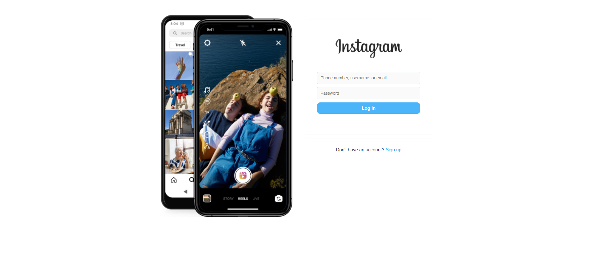
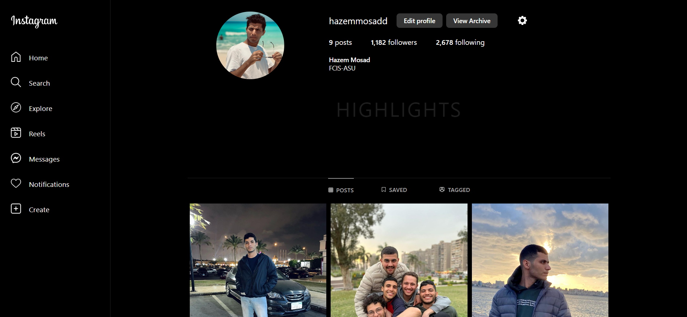

# 📸 Instagram Clone (Frontend In Progress) 🚧


> 🌟 **Note**: This repository contains the frontend code. For the backend Node.js application, please visit [Instagram-Clone-Backend](https://github.com/hazemmosadd/Instagram-Clone-Backend).

## 🌐 Table of Contents
- [Overview](#-overview)
- [Features](#-features)
- [Screenshots](#-Screenshots)

- [Tech Stack](#-tech-stack)
- [Project Structure](#-project-structure)
- [Installation & Setup](#-installation--setup)
- [License](#-license)

## 🌐 Overview
This project is designed to emulate the key features of Instagram's frontend. It serves as an invaluable resource for those interested in understanding the intricacies of building a social media frontend using React.js. Whether you're a novice eager to learn frontend development or an experienced developer looking for a refresher, this project has something to offer.

## 🌟 Features
- [x] 🔐 User Sign In Page
- [x] 🕵️‍♂️ User Profile
- [ ] 📰 News Feed
- [ ] 🔍 Search Functionality
- [ ] 📸 Image Uploads 
- [ ] 💬 Comments and 👍 Likes 
- [ ] 🤝 User Follow/Unfollow Mechanism 
- [ ] 🛎️ Real-time Notifications 

## 📷 Screenshots

### User Sign In Page



## 🚀 Tech Stack
- **React.js**: Frontend Library
- **Node.js**: Backend Logic (See [Backend Repo](https://github.com/hazemmosadd/Instagram-Clone-Backend))


## 📁 Project Structure

- **assets**: Contains static assets like images and icons.
- **components**: Houses reusable UI components and visual building blocks. For example, the `Profile` component displays user profile information.
  
- **containers**: Manages business logic and state management. Containers are essentially "smart" components that handle data fetching, state updates, and other logic. For instance, `ProfileContainer` fetches user profile data and avatar, then passes them to the `Profile` component.
  
- **pages**: Represents the main application views that users interact with. These are composed of various components and containers. For example, `MainScreen` serves as a layout that includes the sidebar and a space for other components, managed by routing.
  
- **routes**: Manages the application routing logic. It determines which components to display based on the current URL. The `AppRoutes` file checks the login status and accordingly renders either the `MainScreen` or `LoginScreen`, along with nested routes for features like the user profile and news feed.
  
- **utils/api**: Contains utility functions for API calls, like `fetchMyProfileData` and `getMyAvatar`
.

> 📝 **Note**: The project is still under active development. Stay tuned for more features and improvements.

## 🛠️ Installation & Setup

### 📋 Prerequisites
- **Node.js**: [Download and Install](https://nodejs.org/en/download/)
- **Backend**: Make sure the [backend](https://github.com/hazemmosadd/Instagram-Clone-Backend) is set up and running.

### 🧰 Steps
1. **Clone the Repository**
    ```bash
    git clone https://github.com/hazemmosadd/Instagram-Clone-Frontend.git
    ```
2. **Navigate to the Directory**
    ```bash
    cd Instagram-Clone-Frontend
    ```
3. **Install Dependencies**
    ```bash
    npm install
    ```
4. **Create `.env` File**
    ```makefile
    # Populate with your API and other environment-specific information
    REACT_APP_API_BASE_URL=...
    ```
5. **Start the Development Server**
    ```bash
    npm start
    ```

## 📜 License
Distributed under the MIT License. See `LICENSE` for more information.

---

Feel free to adapt this README to better suit your project's specific needs.